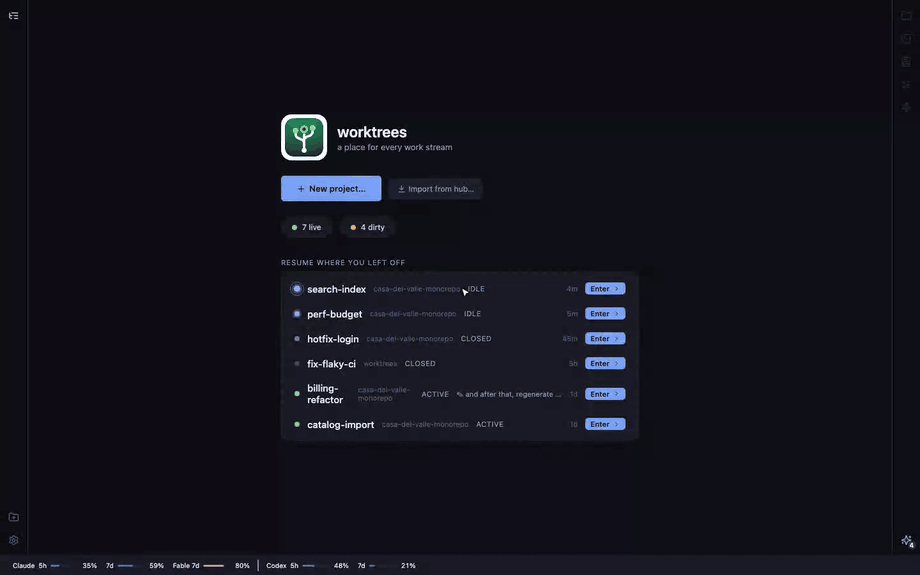
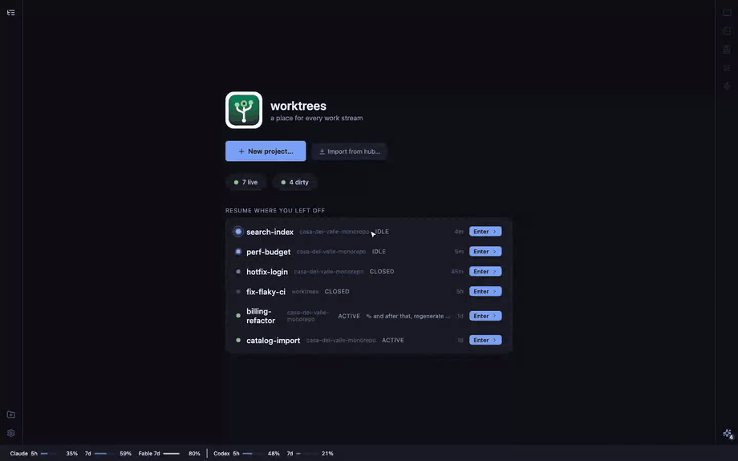
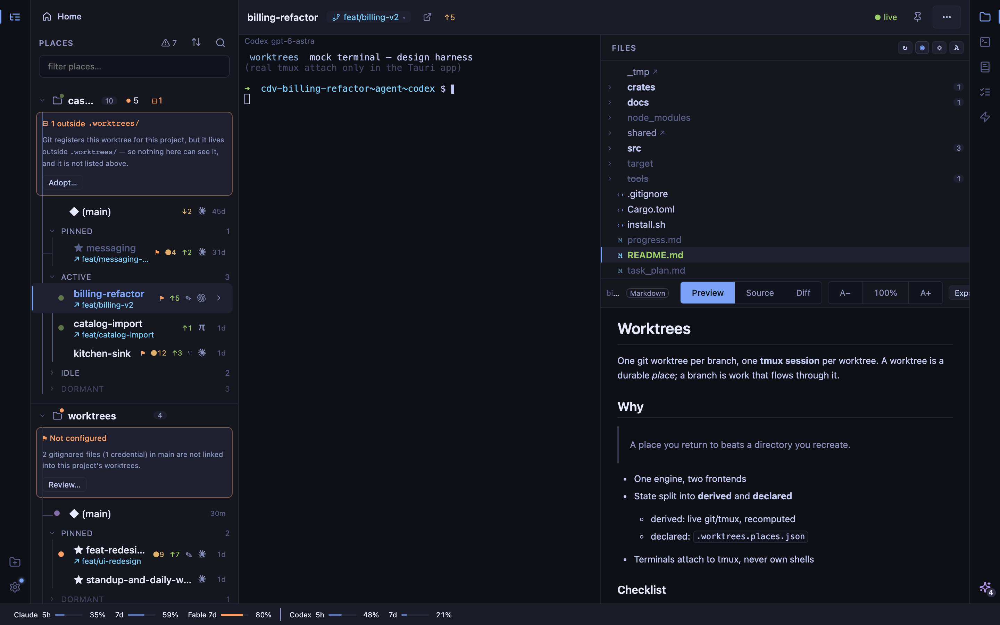
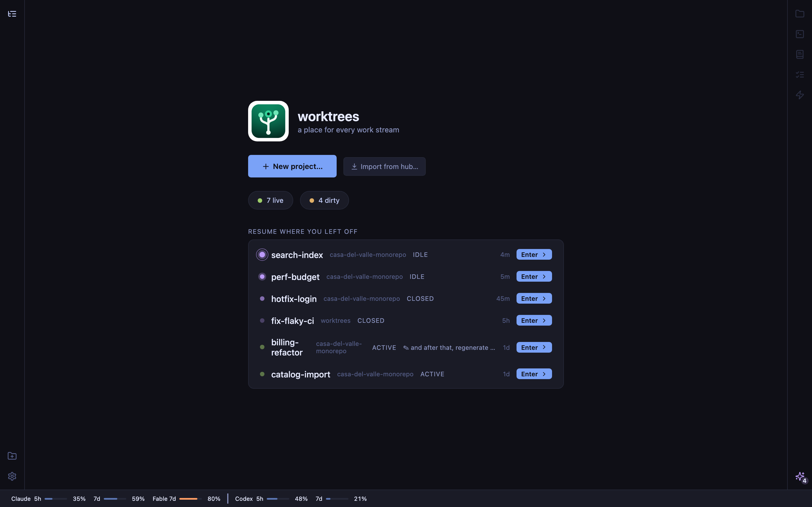

# worktrees

**A durable place for every work stream.** Not a throwaway worktree per branch —
a place you keep: `ui-changes`, `prod-reviews`, `mcp-server`. Each place is a
git worktree + a tmux session — one pane running an AI agent (Claude, Codex,
pi), and with `--spare` a second that installs deps and gives you a shell — and
it lives as long as the work does: an afternoon, or weeks of async iteration
until it's right.

**Branches flow through places.** The place keeps the expensive parts
(directory, agent history, node_modules, the running session); a branch is the
unit of work currently on it. Ship a branch, `switch` the place to the next one,
keep working. The place is named after its first branch unless `--name` says
otherwise; `switch` moves it to the next branch without touching anything
expensive.

```
worktrees new feat/checkout          # worktree + branch + tmux (agent | deps+shell)
worktrees ls                         # what places exist, what's on them
worktrees switch feat/checkout-v2    # same place, next branch (run inside it)
worktrees open feat-checkout         # reattach later
worktrees rm feat-checkout           # tear the place down when it's done
```

Works in **any** git repo. No config required.

## Desktop app

Same engine, a native window. The macOS app (Tauri) links the identical Rust
core in-process — no daemon, no subprocess — so everything the CLI knows, the
app shows live.

<p align="center">
  
</p>

<p align="center"><sub><i>Home → Places → new worktree (branch, agent, model) → the place lands live. Driven headlessly against the built-in mock harness; the real app embeds a live tmux terminal running your agent.</i></sub></p>

**Places** groups every worktree by project and by how active it is — pinned,
active, idle, dormant — with a dot per lane showing whether its agent is
working, waiting on you, or finished since you last looked. Ahead/behind, dirty
state and the branch sit on the row. The header filters to just the places
wanting attention, re-sorts, and searches.

**The dock** is the other half of the window, and it is why this stopped being
only a launcher:

<p align="center">
  
</p>

| Tab | What it is |
|---|---|
| **Files** | The worktree's tree, with changed files marked. Opens anything in a viewer with Preview / Source / Diff — the diff is against the branch's base (`origin/main`, or the first of `origin/master`/`main`/`master` that resolves), with a toggle for HEAD. |
| **Terminal** | Extra shells in the worktree, in tabs, each remembering its directory and its scrollback across restarts. ⌘-click a file path in any terminal to open it in the viewer, at its line. |
| **Docs** | Every markdown document in the place — your docs, ADRs, and the agent's own `.planning/` files — with the ones new since you last looked marked. |
| **Plan** | What the place is *for* and how far along it is, read from the planning files the agent already writes. |
| **Automations** | Briefs Claude runs across the project, on a schedule or on demand. Every run leaves a report. |

Across the bottom, a usage strip shows every plan window you have — Claude's
5h and weekly, each model's weekly bucket, Codex's windows — so a nearly-spent
allowance is visible before you spend the rest of it.

<p align="center">
  
</p>

<p align="center">
  
</p>

Each project has a settings sheet — from its context menu, or from the badges
in its header — that reports what needs repairing and offers the one button
that repairs it: files declared in `.worktrees.toml` that are not linked,
worktrees git registered outside `.worktrees/` (which this tool cannot see),
missing port allocations, and whether your agents' instruction files and skills
are set up. Six themes, light and dark; ⌘B toggles Places, ⌘J the dock, ⌘F
searches the terminal, ⌘± zooms everything including the terminal, and
⌘[ / ⌘] step back and forward through the places you have visited.

Install it alongside the CLI on macOS (`WORKTREES_INSTALL_APP=1`, or answer the
installer prompt; from a clone, `make install-app`) — see [Install](#install).

## Install

Fresh machine (installs the latest release to `~/.local/bin`):

```sh
curl -fsSL https://raw.githubusercontent.com/penard-monkey/worktrees/main/install.sh | bash
```

Teams should pin a release for reproducibility:

```sh
curl -fsSL https://raw.githubusercontent.com/penard-monkey/worktrees/v0.36.0/install.sh | bash
```

A tagged script installs its own release (for tags after v0.29.0; older ones
also need `WORKTREES_INSTALL_VERSION=<tag>`). The app can install any release,
including an older one, from Settings → Updates.

The installer fetches the prebuilt binary for your platform (macOS/Linux,
x86_64/arm64); with no match, or `WORKTREES_INSTALL_FROM_SOURCE=1`, it builds
from source with `cargo`.

On macOS it also **offers the desktop app** (`worktrees.app` → /Applications,
checksum-verified; the unsigned bundle's quarantine attr is stripped on your
explicit opt-in). Non-interactive runs skip the prompt — opt in/out explicitly:

```sh
WORKTREES_INSTALL_APP=1 \
  curl -fsSL https://raw.githubusercontent.com/penard-monkey/worktrees/main/install.sh | bash
```

From a clone, `make install-app` builds the app locally and installs it to
/Applications (no signing or quarantine involved).

Or clone and build (`make install` compiles the release binary and symlinks it —
`git pull && make install` upgrades):

```sh
git clone https://github.com/penard-monkey/worktrees && cd worktrees && make install
```

Re-running the installer upgrades. `install.sh --uninstall` removes the binary
(your repos' worktrees and tmux sessions are untouched).

## Updating

Re-running the installer **is** the updater — it resolves the latest release,
prints the old → new version, verifies the checksum, and replaces the binary
in place:

```sh
curl -fsSL https://raw.githubusercontent.com/penard-monkey/worktrees/main/install.sh | bash
worktrees --version   # confirm
```

Roll back (or hold) a version by pinning the release tag:

```sh
WORKTREES_INSTALL_VERSION=v0.30.0 \
  curl -fsSL https://raw.githubusercontent.com/penard-monkey/worktrees/main/install.sh | bash
```

The same re-run updates the desktop app when you opt in (`WORKTREES_INSTALL_APP=1`
or answer the prompt); quit + reopen the app to pick up the new version.

From a clone instead: `git pull && make install` (note: `make install` symlinks
the clone's release build — later `cargo build`s in that clone update it too.
For a frozen copy, `install -m 755 target/release/worktrees ~/.local/bin/worktrees`).
App from a clone: `git pull && make install-app`.

Updates never touch your repos' state: worktrees under `.worktrees/`, the
declared store (`.worktrees.places.json`, schema-versioned), tmux sessions, and
`~/.config/worktrees/config` all survive binary swaps. Running sessions keep
running — the CLI attaches to tmux, it doesn't own it.

**Requires:** git ≥ 2.23. tmux ≥ 1.9 recommended (`new` degrades to `--no-tmux`
without it; `open` needs it). Prebuilt binaries for macOS + Linux (x86_64/arm64);
building from source needs a Rust toolchain.

## Commands

```
worktrees new <branch> [base]         create a worktree + tmux (one agent pane; --spare adds a shell)
worktrees new <branch> --name <topic> ...place named independently of the branch
worktrees co  <branch>                checkout a REMOTE branch (fetch if needed)
worktrees switch [<worktree>] <branch> [base]   move a worktree to another branch
worktrees open <name>                 open or switch the active agent
worktrees close <name> [name...]      end the tmux session (worktree stays; also: main)
worktrees ls [--json]                 list worktrees + state (--json = machine-readable)
worktrees rm <name> [name...]         tear one (or more) down
worktrees                             (no args) → ls
```

`new`/`co`/`switch` are do-what-I-mean: reuse an existing worktree, check out an
existing local **or** remote branch (fetching it first), or create a new branch
off `[base]` (default `main`). `origin/feat/x` is accepted and normalized to
`feat/x`. If a branch already lives in a differently-named worktree (after a
`switch`), `new`/`open` find and reuse that place instead of failing.

Flags:

| Command | Flags |
|---|---|
| `new`/`co`/`open` | `-r/--resume` (append the agent's resume flag) · `--ai claude\|codex\|pi` · `--model <m>` (pi takes `<backend>/<id>`) · `--force` (launch despite an advisory refusal — see below) · `--spare` (add a spare shell as pane 1; for `new` it runs the detected install there — without it the install is printed as a `then:` hint) · `--no-spare` (accepted, and the default: single pane) |
| `new`/`co` | `--no-install` · `--no-tmux` · `--no-attach` · `--no-fetch` · `--name <topic>` · `--brief <text>` (write the agent's task to `.planning/brief.md` and launch the selected agent on it) |
| `switch` | `--force` (despite uncommitted changes) · `--no-fetch` · `-y` |
| `rm` | `--branch` (delete the branch too) · `--force` · `-y/--yes` |
| `close` | `--ai <agent>` (close just that one; unqualified closes both) · `-y` · `--session <s>` |

**An agent is not started on a plan window that is nearly spent.** Before a
session is created, the harness asks its own provider how much of the current
window is left and refuses the LAUNCH when the provider's own grade says
warning (Codex: 80%) — naming the window, the percentage and when it resets.
The worktree, the branch and the brief are created either way: only the agent
waits, so nothing has to be re-typed once the window rolls over. `--force`
launches anyway (the app: **Launch anyway**; MCP: `force: true`), and
`worktrees open <slug> --force` is the retry it prints.

It fails open in every direction — no reading, an unreadable one, a provider
with no allowance to report, or `--no-tmux` (no agent starts at all) and the
launch simply proceeds. It is deliberately not a burst limiter: lanes bill
after their first turns, so eight started at once are all admitted and the gate
first speaks once the window is already spent. `WORKTREES_USAGE_PROBE=off`
switches the gate off entirely (the app's usage meter keeps reading). The check
costs a launch one reading of the provider's usage — usually cached, but on a
network that hangs rather than fails it can hold a `new` for up to ~15s
(Claude's GET) or ~13s (Codex's probe) before failing open; `--force` skips
the reading altogether.

Guards you'll be glad exist: dirty worktrees refuse to `switch`/`rm` (override
with `--force`); a stale *unregistered* dir under `.worktrees/` is never treated
as a worktree (git would silently operate on your main checkout); `switch` from
inside worktree A targeting worktree B asks first; a typo'd worktree name can't
silently mint a junk branch.

### Keeping a project healthy

```
worktrees doctor [<name>]             file drift, declared and un- (--json --strict --config-only)
worktrees status <name>               health verdict for one worktree (--json)
worktrees relink [<name>|--all]       re-apply .worktrees.toml's files (--force to overwrite)
worktrees provision [<name>|--all]    allocate a port slot + write .worktree.env (--reallocate)
worktrees init                        suggest a .worktrees.toml for this repo (--print, -y, --diff)
```

A repo needs no config. `.worktrees.toml` is opt-in and does one thing: declare
the gitignored files a new worktree should get from the main checkout — `.env`,
credentials, local overrides — as links or copies. `init` proposes one from
what it finds; `doctor` reports what has drifted since, including gitignored
files in main that nothing declares, and worktrees git has registered outside
`.worktrees/` (which this tool cannot see until you `git worktree move` them).

### Agents, docs and automation

```
worktrees automations [ls|add|rm]     briefs Claude runs across this project
worktrees automations run <slug>      run one now (0 clean, 2 findings, 1 failed)
worktrees agent-setup [status|fix|link-skills]  CLAUDE.md/AGENTS.md + skills for every agent
worktrees skills [list|show|add|rm]   manage AI-profile skills (user-global, no repo needed)
worktrees projects [ls|add|rm|rename|private]  the registered projects (user-global)
worktrees guide [--status] [--json]   what agents are told about places (--rules, --default)
worktrees show <file>[:line]          ask the worktrees app to open a file, at a line
worktrees sync push|pull|status       courier-sync this project to/from an SSD hub (rsync)
worktrees trust pi [<repo>] [--revoke]  let a repo's own pi resources load
worktrees mcp [--mutations]           MCP server over stdio (for an agent session)
worktrees mcp --install [--ai codex|pi] [--read-only]   connect the tools (--uninstall removes)
worktrees mcp --status [--json] [--ai codex|pi]         check the setup (no repo needed)
worktrees mcp --cross-project off|read|full   narrow this server's reach, never widen it
```

## Agents

A place runs **one** agent at a time: `claude`, `codex` or `pi`. Pick it per
launch with `--ai`, or set a default; `--model` picks the model for that launch
(pi needs one, `<backend>/<id>`, and refuses a launch whose model host is down).
Switching providers in a place closes the running session first; each keeps its
own saved conversation, and `-r` resumes it.

**A brief is how an agent gets its task.** `--brief <text>` writes
`.planning/brief.md` in the worktree and launches the agent pointed at it. The
brief is never passed as a command-line argument, so it survives a resume and
is readable by you and by the next agent in that place.

**Agents can talk to each other** through the MCP server — whichever provider
each one is, and, when you turn it on, across projects as well as within one
(`worktrees mcp --cross-project`, off by default; a server can narrow its own
reach but never widen it). `report` posts a message to another place
(`(main)` unless told otherwise; `reply_to` threads an answer), `messages`
reads what was sent to your place, and `wait` blocks for up to two minutes
until another place's agent goes idle or a message arrives, so an agent waits
instead of polling. The sender is the place the agent is working in, never a
name it passes; anything running as your user can still write the log, so that
is the trust boundary. Messages live in the repository's shared git data,
untracked, and expire after a week. With `--mutations`, `send` types one line
into another place's Codex or pi, labelled with the sending place and never
while that agent is waiting on an approval; for a Claude place it answers with
the session name to use with Claude's own messaging.

Connect the tools per provider in the app (Settings → Claude / Codex / pi) or
with `worktrees mcp --install [--ai codex|pi]`. One user-scope install serves
every repo — the server discovers the project from the session's directory.
A read-only install omits every tool that changes anything.

**Sign-in is each CLI's own.** Worktrees never asks for or stores an API key.
Codex launches require ChatGPT account sign-in (`codex login` once; if Codex is
signed in with an API key, `codex logout` then `codex login`). Every Codex
launch also passes `-c project_doc_fallback_filenames=["CLAUDE.md"]`, so a
CLAUDE.md-only project briefs Codex without a repo change; `worktrees
agent-setup` can instead make AGENTS.md the one instruction file via a PR, and
link your `~/.claude/skills` where Codex and pi look for them.

## The tmux layout

Each worktree gets a session named `<prefix>-<slug>`: pane 0 launches the agent
through an interactive shell (so shell aliases resolve), and that is the whole
session by default. `--spare` adds pane 1, which runs the detected
package-manager install (pnpm/bun/yarn/npm, by lockfile) and drops to a shell;
without it `new` prints the install command as a `then:` hint. Sessions are
reused, never duplicated — `open` finds a session already
living in the worktree even under a different name.

## JSON output

`worktrees ls --json` (or `WORKTREES_JSON=1 worktrees ls`) emits a machine-readable
snapshot instead of the table — for editors, scripts, and tooling. The human `ls`
output is byte-for-byte unchanged. Shape (`schema_version` 1):

- a wrapper `{schema_version, repo, prefix, places_file, places:[…]}`;
- the **main checkout first** (`slug:"(main)", is_main:true`), then each worktree in
  the same recency order as the table;
- per place: `slug, path, branch` (null when detached, with `detached:true`),
  `dirty, dirty_files, ahead, behind, upstream` (the last three null when there's no
  upstream), `created, created_epoch, last_commit_epoch, last_commit_subject,
  tmux_session:{name,up}, claude_session_present, install_cmd`, and `lifecycle_effective`.

All state is derived live on every call — nothing is cached. No `jq` required to
produce it.

## Configuration

Precedence: **flag > environment > user config > default.** The user config is
two files in `~/.config/worktrees` (respecting `$XDG_CONFIG_HOME`):
`config.toml` first, then the original `key = value` `config` as a permanent
silent fallback, so an install predating TOML keeps working and nobody has to
migrate. Both are parsed as data, never executed.

| What | Flag | Env | Config key | Default |
|---|---|---|---|---|
| Agent command | `--ai <cmd>` | `WORKTREES_AI_CMD` | `ai_cmd` | `claude` |
| Agent resume argument (`-r` appends it) | — | `WORKTREES_AI_RESUME_ARG` | `ai_resume_arg` | Claude: `-r`; Codex: `resume --last` |
| Default model per agent | `--model <m>` | — | `[model]` in `config.toml`, e.g. `claude = "opus"` | the CLI's own default |
| Session/name prefix | — | `WORKTREES_PREFIX` | `prefix` | repo dir name |
| Codex permissions (`ask`, `auto-review`, `full`) | — | `WORKTREES_CODEX_PERMISSIONS` | `codex_permissions` | `auto-review` |

```toml
# ~/.config/worktrees/config.toml
ai_cmd = "codex"

[model]
claude = "opus"
pi = "lm-studio/qwen3.6-27b"
```

- `ai_cmd = none` (or `--ai none`) → pane 0 is a plain shell, no agent.
- A repo can pin its prefix with a committed `.worktree-prefix` file (one line);
  the env var wins over it.
- Pane 0 hands the command to your `$SHELL -ic` — aliases work; assumes a
  POSIX-ish (bash/zsh/sh) login shell.
- The app's Settings → Codex → Permissions overrides env and config for
  launches the app makes; the CLI and MCP use env/config. `auto-review` is
  `--approve-for-me` plus a sandbox that can also write the repo's git common
  dir (so `git commit` works in a worktree — that includes `.git/hooks` and
  `.git/config`) and reach the network.

Examples: `--ai claude`, `--ai "claude --model opus"`, `--ai codex`,
`--ai pi --model lm-studio/qwen3.6-27b`, `--ai none`.

## Compatibility notes

- macOS: stock `/bin/bash` 3.2 is fully supported (CI runs the whole suite on it).
- `.worktrees/` is added to `.git/info/exclude` automatically — worktrees never
  show up as untracked files.
- `rm` deletes the worktree and its tmux session; the **branch survives** unless
  you pass `--branch`.

## Development

```sh
git clone --recurse-submodules https://github.com/penard-monkey/worktrees
make check            # shellcheck + bash-3.2 gates + bats suite
make test-real-tmux   # integration smokes against real tmux
```

Tests are bats-core (vendored as submodules); the suite fakes git and tmux with
PATH shims so every pane command is assertable, and CI runs ubuntu + macos, the
latter twice — once under stock bash 3.2. `cargo test -p worktrees-core -p
worktrees-cli -p app --lib` covers the engine, the MCP protocol and the app
backend.

### Running the desktop app from source

The app is Tauri, so `cargo` is driven for you — there is no `cargo run`. Node
must match `.nvmrc`, and dependencies are installed once per clone:

```sh
nvm use                      # or any node >= the version in .nvmrc
pnpm --dir app install       # first time only
make dev-app                 # or: pnpm --dir app tauri dev
```

That builds the `app` crate and serves the frontend on **port 1420**, with hot
reload on the TypeScript/CSS side; a Rust change rebuilds and relaunches the
window. Real git and tmux are used, so it acts on whatever projects you have
registered.

To work on the UI alone — no Rust build, no tmux, fake backend — use the mock
harness, which runs the real `App.tsx` against fixtures in a plain browser:

```sh
pnpm --dir app dev:mock --port 1425    # any port but 1420
```

Both are development loops. To actually *use* a locally built app, see
`make install-app` under [Install](#install) — that produces the bundle and puts
it in `/Applications`.

### Scripts

| Script | What it does | Touches |
|---|---|---|
| `sandbox.sh` | Builds the current branch and hands you an isolated worktrees to test it in. `--app` launches the desktop app against it. | a scratch repo, or one you name with `--repo` |
| `record-readme.sh` | Regenerates the README's desktop media (`docs/media/desktop-*.{gif,png}`). | nothing — mock harness |
| `shoot-profiles.sh` | Regenerates the AI-profiles screenshots for `docs/ai-profiles.html`. | nothing — mock harness |
| `record-profiles.sh` | Regenerates that page's walkthrough clip (`walkthrough.mp4`). | nothing — mock harness |
| `*-check.mjs` | Drift and behaviour guards that evaluate the real frontend source. Run from the repo root, as CI does. | nothing |

The three media scripts drive the **mock harness** — the real `App.tsx` against
fixtures, in a plain browser — so they are deterministic and cannot touch your
projects. The `.py` file beside each is the Playwright driver; run the `.sh`,
which starts the harness (or reuses one already on `$PORT`), drives it, encodes,
and cleans up. `record-readme.sh` takes `PORT`, `PYTHON`, `FFMPEG`, `FPS`,
`GIFW` and `RECORD_OUT` if your toolchain lives somewhere unusual.

`sandbox.sh` is the exception: it builds and runs the REAL binary, against a
scratch repo by default and against whatever you pass to `--repo` if you ask.

They need Python Playwright and Chromium once — `pip install playwright &&
playwright install chromium` — plus `ffmpeg` for the ones that record video.

#### Testing a branch without disturbing an app you already have open

```sh
eval "$(app/scripts/sandbox.sh)"    # CLI: isolated env + a scratch repo
app/scripts/sandbox.sh --app        # …or the desktop app against that sandbox
app/scripts/sandbox.sh --clean
```

This matters more than it sounds. tmux session names are `<prefix>-<slug>`
derived from the repo, so **a second build computes the same name and attaches to
the session your open app is using** — closing it in one kills it in the other.
The sandbox takes a per-branch prefix (`sbx-<branch>-<slug>`), which both
prevents that and is how you tell them apart:

```sh
tmux ls | grep sbx-      # sandboxes, one prefix per branch
tmux ls | grep -v sbx-   # yours, untouched
```

It also isolates the AI-profile store and, with `--app`, overrides the bundle
identifier so the sandbox app gets its own `ui-state.json` instead of sharing
yours.

## License

MIT
