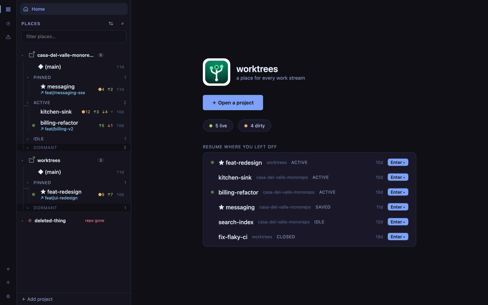
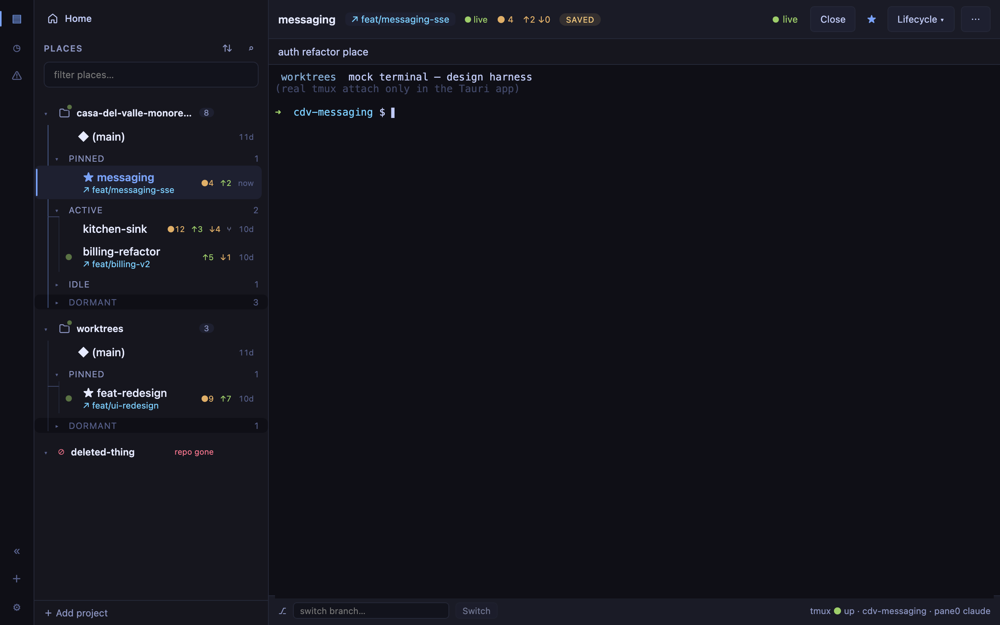

# worktrees

One git worktree per branch, one tmux session per worktree. A worktree is a
durable **place**; a branch is work that flows through it.

A Rust CLI and a macOS desktop app share one engine — the app links the core
in-process, so both see exactly the same state.

[Source on GitHub](https://github.com/penard-monkey/worktrees) ·
[Latest release](https://github.com/penard-monkey/worktrees/releases/latest) ·
[Changelog](https://github.com/penard-monkey/worktrees/blob/main/CHANGELOG.md)


## Install

```sh
curl -fsSL https://raw.githubusercontent.com/penard-monkey/worktrees/main/install.sh | bash
```

The installer verifies a checksum before it copies anything. From a clone,
`make install-app` builds the desktop app and puts it in `/Applications`.
Full instructions, including the update path, are in the
[README](https://github.com/penard-monkey/worktrees#install).

## The idea

State is split in two, deliberately:

- **Derived** — live git and tmux, recomputed on every read. Never cached into
  a database, so it cannot go stale.
- **Declared** — `.worktrees.places.json`: lifecycle, pin, note. Plain JSON, no
  schema migrations, readable with `cat`.

Terminals **attach** to tmux; they never own a shell. Close the app, the work
keeps running.



## Documentation

| Document | What's in it |
|---|---|
| [README](https://github.com/penard-monkey/worktrees#readme) | install, commands, configuration, tmux layout |
| [DESIGN.md](https://github.com/penard-monkey/worktrees/blob/main/DESIGN.md) | the app's design document |
| [AI profiles](ai-profiles.html) | what a worktrees-launched `claude` runs with — rules, skills, MCP servers, model |
| [Decisions (ADRs)](adr/) | choices that must survive being forgotten |
| [Proposals](proposals/) | designs written up before they were built |
| [Roadmap](https://github.com/penard-monkey/worktrees/blob/main/ROADMAP.md) | kept, but not now |
| [Development log](sessions/) | one archive per working session — what shipped, what was decided, what went wrong |

## Desktop app

A place, its branch state, and its embedded terminal — with a dock that browses
and renders the worktree's files.


