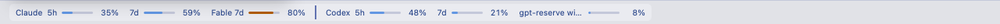
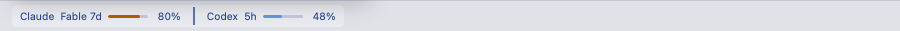
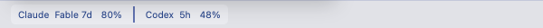

# Usage strip review captures

Captured from the mock (`?codexUsage=multi`) with headless Playwright WebKit on
macOS. These are review evidence for the all-window strip; the fixture includes
an extra Codex reserve bucket with a deliberately long name.

| Viewport | Visible windows | Bars |
| --- | --- | --- |
| 1280px | Claude 5h, 7d, Fable 7d; Codex 5h, 7d, reserve 7d | Six, 40px each |
| 900px | Claude Fable 7d; Codex 5h (highest main usage per provider) | Two, 40px each |
| 600px | Same two windows | Hidden |

At 1280px, both Chromium and WebKit measured the button at 821.94px and its
inner content at 805.94px. All labels have nonzero width; long bucket names
ellipsize. Provider windows may wrap if additional buckets need more room.

The footer uses its own available width. With the mock's pinned navigation,
its content widths at these viewports were 868px, 488px and 188px: respectively
two windows with bars, two without bars, and the existing `Usage ▾` trigger.
The rail retains its glyph. Every host opens the full details panel.

The provider divider is 2px wide and at least 18px tall, using `--txt-dim`.
Contrast against the composited hover surface, identical in both engines:

| Theme | Contrast |
| --- | --- |
| tokyo-night | 5.37:1 |
| tokyo-day | 3.88:1 |
| catppuccin-mocha | 5.65:1 |
| catppuccin-latte | 3.20:1 |
| nord | 3.21:1 |
| gruvbox-dark | 5.32:1 |

## 1280px

## 900px

## 600px

