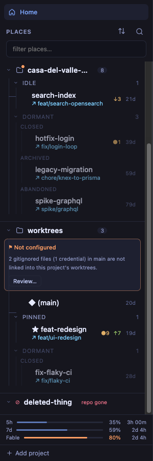

# Session: nav hierarchy — projects up, dormant down

- **Date:** 2026-08-06 (archived 2026-08-07)
- **Worktree:** ui-tweaks
- **Branches:** ui-nav-hierarchy (feature), ui-closeout-nav-hierarchy (this archive)
- **PRs:** [#84](https://github.com/penard-monkey/worktrees/pull/84) (squash-merged → `29b2aea`)
- **Release:** none — lands in `[Unreleased]`, next tag picks it up
- **Planning files:** planning.tar.gz alongside this summary (task_plan / findings / progress)

## Where this started

One screenshot and one sentence: *"on the left nav I want to tweak so that it's
easier to see the project and make dormant seem less pronounced — I'm not very
happy with it now that I have a few projects open."*

Three projects in the tree, catppuccin-mocha. The obvious reading is "the
project header needs more emphasis", and the obvious fix is to add some — a
band, a colour, a bigger icon. That reading is wrong, and the screenshot proves
it if you measure instead of look.

## The actual diagnosis

**The project header was smaller type than its own children.**

| element | selector | size | weight |
|---|---|---|---|
| project name | `.pname` (App.css) | `--fs-label` 0.8125rem | bold |
| place slug | `.row-name` (App.css) | `--fs-row` 0.9375rem | medium |

Same colour (`--txt-hi`), no rule between projects, no band — the *only* thing
marking a project was its position in the flow. With one project open, position
carried it. With three, the eye lands on `★ bug-fixes` before it finds the repo
that owns it, because that string is literally bigger.

For dormant, pixels were sampled straight out of the screenshot rather than
eyeballed: nav `#181825` (`--bg-tree`), dormant band `#11111b` (`--bg-abyss`) —
so the band *was* darker, exactly as the "darker = deader" comment in App.css
intended. It still read as the loudest thing in the lower half of the nav. A
hard-edged full-bleed rectangle is a **figure, not a ground**: it cuts across
the tree, and sitting last inside each project it doubled as a false separator
competing with the next project header. Recession by fill was the wrong tool.

## What shipped

`app/src/App.css` (four rule blocks) and `app/src/App.tsx` (one line):

| | before | after |
|---|---|---|
| `.pname` | `--fs-label` bold | `--fs-row` bold + `.01em` tracking |
| `.project + .project` | `margin-top: 8px` | `12px` + hairline `--line` |
| `.project-h` | static | `sticky top:0 z:2`, opaque `--bg-tree` |
| `.group.dormant` | `background: --bg-abyss`, `--r-md` | `opacity: .62`, no fill |
| dormant caret | ASCII `▾` / `▸` | `Icons.ChevronDown` / `ChevronRight` |

Details that matter:

- **Sticky needed no DOM change.** `.nav-scroll` was already the
  `overflow-y: auto` container, and each `.project-h` sticks inside its own
  `.project` box — so the next project pushes the previous one out via native
  sticky stacking, for free.
- **The opaque background is load-bearing.** Rows pass *under* the stuck header;
  without `background: var(--bg-tree)` they show through it.
- **The hairline lives on `.project`, not on `.project-h`.** On the header it
  would ride along when stuck, drawing a stray rule across the top of the nav.
  On the project it scrolls away with the content it opens.
- **Dormant restores on three conditions**, not one: `:hover`, `:focus-within`,
  and `:has(.row.sel)`. The third is the non-obvious one — `opacity` inherits to
  descendants, so entering a dormant place would otherwise leave the row you are
  standing in dimmed.
- **The rail x-math is untouched.** Dormant rows still resolve to
  `padding-left: 47px` (`--s3 + --ind × 2.5`) and the `::before` rail to `--gx3`
  (42px). This was checked, not assumed — the old band was full-bleed
  *specifically* because the rails need a left edge at 0, so any padding added
  while removing it would have shifted every dormant row.

## Decisions

- **Sticky project headers — yes.** Offered as one of three options (typography
  only / sticky+strong / sticky+filled band); the user took sticky+strong. The
  filled-band variant was the one to avoid: the whole complaint was that the nav
  already had one rectangle too many.
- **Recede dormant by fading, not by banding.** See the diagnosis above. Fading
  has no edge, so it cannot be mistaken for a divider.
- **Size parity, not size dominance.** `.pname` ties `.row-name` at `--fs-row`
  and wins on weight (600 vs 500) plus the rule and the sticky. Going *larger*
  than a slug would have made truncation much worse at narrow nav widths for no
  extra legibility.
- **Swap the dormant caret to the shared SVG chevron.** It was the only ASCII
  caret left in the nav — one more thing making the quietest row visually
  distinct from every other group header.
- **Changelog under `### Changed`**, not `### Added`; `[Unreleased]` had no
  Changed section yet.

## Dead ends / gotchas

- **`origin/main` was AHEAD of the worktree's HEAD, out of PR-number order.**
  This worktree sat on `b3e6315` = "close out usage-countdown (#83)", which
  looks like the tip. It was not: **#72 (AI profiles) merged *after* #83** —
  a long-lived PR landing late — so `origin/main` was `6585c50`, one commit
  ahead. `git log --oneline -1` gives no hint of this, and PR numbers are not
  merge order. What caught it was
  `git rev-list --left-right --count origin/main...HEAD` after an explicit
  `git fetch` → `1  0`. Fix was `git stash` → `git switch -c <branch>
  origin/main` → `git stash pop` (clean auto-merge; #72 touched neither
  `.project*` nor `.group.dormant`), then **re-running the gates and the whole
  harness assertion set on the new base**. Lesson: fetch and diff against
  `origin/main` before branching, every time — a worktree that has been idle is
  not necessarily behind by zero just because its last commit is recent.
- **`opacity` on `.group.dormant` inherits to descendants and creates a stacking
  context.** The first version dimmed a selected dormant row along with
  everything else. `:has(.row.sel)` is the fix; `:hover` alone is not enough
  because the row stays selected after the pointer leaves.
- **The Playwright MCP screenshot tool refuses paths outside the repo root**
  (`File access denied: … is outside allowed roots`), so screenshots cannot be
  written straight to `~/.cache/worktrees/…` as the scratch-file rule wants.
  They land in the repo and have to be moved afterwards. Same for
  `.playwright-mcp/` (gitignored, 30 files by end of session) — swept to
  `~/.cache/worktrees/worktrees/ui-tweaks/playwright-mcp/` at close-out.
- **The `.worktrees/` HMR trap held true again.** Harness started with
  `--force` on port 1421, and the served CSS was diffed against disk
  (`curl -s localhost:1421/src/App.css`) *before* trusting any measurement.
  Restarted the same way after the rebase, since the branch switch changed files
  under a running server.
- **Bash cwd persists between tool calls.** Bit twice: a `sed` against
  `App.tsx` from `app/src`, and `git add CHANGELOG.md` from `app/`
  (`fatal: pathspec 'CHANGELOG.md' did not match any files`). Absolute paths, or
  a leading `cd` to the repo root, every time.

## Verification

Asserted with `getComputedStyle` in the mock harness rather than by eye, per
CLAUDE.md — and re-run in full after the rebase onto #72:

| check | result |
|---|---|
| `.pname` | `14.0625px` @ 600 |
| `.row-name` | `14.0625px` @ 500 — ties on size, loses on weight |
| `.project-h` | `position: sticky`, `top: 0px`, `z-index: 2`, bg `rgb(22,22,30)` == `.nav` bg |
| `.project + .project` | `border-top: 1px rgb(37,40,56)`, `margin-top: 12px` |
| `.group.dormant` | `background-color: rgba(0,0,0,0)`, `opacity: 0.62`, `border-radius: 0px` |
| hover restore | hovered group `opacity: 1`, sibling stays `0.62` |
| rules parsed | `:hover`, `:focus-within`, `:has(.row.sel)` all present in `cssRules` |
| rails unmoved | dormant row `padding-left: 47px`; `::before` left `42px` (`--gx3`) |
| dormant caret | `svg` present |

Sticky was proven **behaviourally**, not just declared: with `.nav-scroll`
scrolled 203px the three header tops read `[0, 313, 648]`, a `.row` rect
overlaps the stuck header, and `elementFromPoint` at the header's centre returns
`.pname` — rows pass under it, not through it.

Gates (all green, re-run after the rebase): `cargo build --release -p
worktrees-cli`, `make test` 249/249, `make lint`, `cargo test -p worktrees-core`
143 passed, `tsc --noEmit`, `cargo check -p app`. CI green on all 9 checks
before merge.

## Follow-ups

- **Only verified in dark themes.** The harness runs tokyo-night and the
  complaint screenshot was catppuccin-mocha. Everything keys off tokens
  (`--bg-tree`, `--line`), but `opacity: 0.62` is a fixed number, and 62% on a
  light background is a different perceptual step than 62% on a dark one.
  Worth a pass through tokyo-day / catppuccin-latte.
- **Long project names truncate sooner** at narrow nav widths
  (`casa-del-valle-mo…`), the direct cost of `--fs-row` on `.pname`. The
  `title={pv.root}` tooltip covers it and the nav is resizable, so this was
  accepted rather than fixed.
- The fable-reviews-before-merge split was skipped for this PR — the session
  model wrote and merged it after the user said to merge. Noted, not a defect.
