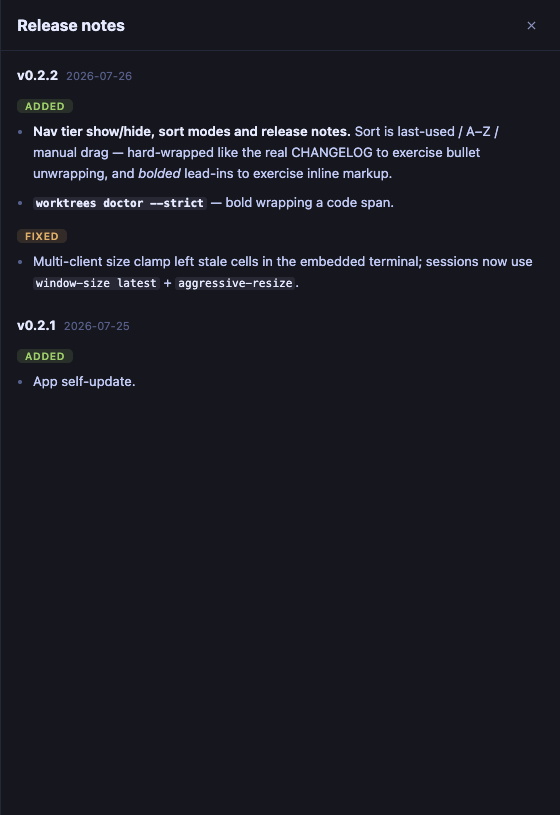

# Session: release notes render their own markdown

- **Date:** 2026-08-07 (archived 2026-08-09)
- **Worktree:** ui-tweaks
- **Branches:** ui-relnotes-inline-markdown (fix), ui-closeout-relnotes-markdown (this archive)
- **PRs:** [#90](https://github.com/penard-monkey/worktrees/pull/90) (squash-merged → `e8b32fb`)
- **Release:** shipped in **v0.9.1** ([#93](https://github.com/penard-monkey/worktrees/pull/93), tagged the same day) — written as `[Unreleased]`, swept in by the release cut hours later
- **Planning files:** none (single-defect session)

## Where this started

> "the markdown on the 'What's new — v0.9.0' is text and isn't formatted.
> Release notes don't look great. should be a quick fix. right?"

It was a quick fix. The interesting part is *why the sheet was half-right*,
because the half that worked is what hid the half that didn't.

## The diagnosis

`ReleaseNotes` (App.tsx) does not hand the changelog to a markdown renderer.
It parses keepachangelog itself — `parseNotes()` splits `## [version] - date`
sections, `### Added` groups and `- ` bullets, unwrapping hard-wrapped
continuation lines — and renders that structure with its own vocabulary:
version + date header, a coloured group chip (`.rel-added` / `.rel-fixed` / …),
a list. That is a deliberate design, not an accident of not having a renderer:
the app *does* have one (`markdown.tsx`, marked's lexer only, used by the dock),
and it would have produced generic `<h2>/<h3>` prose instead of chips.

All of that worked. What didn't was one function underneath it:

```tsx
// `code spans` → <code>; the only inline markup the changelog uses.
function renderInline(s: string): React.ReactNode[] {
  return s.split(/`([^`]+)`/g).map((part, i) => (i % 2 ? <code key={i}>{part}</code> : part));
}
```

The comment was true when it was written and quietly stopped being true. The
changelog's house style now opens most entries with a bolded lead-in sentence —
**10 of them in the v0.9.0 section alone**, plus one `*by*` italic — and every
one of those printed its asterisks. Because the sheet's *structure* still
rendered correctly (chips, versions, bullets), it read as "the markdown isn't
formatted" rather than as a parser failure, and nothing pointed at the four
lines actually responsible.

The `<pre className="notes">` raw-text fallback in `ReleaseNotes` was never
reached — worth stating, because "unformatted release notes" is exactly what
that fallback looks like, and it is the wrong thing to go debug.

## The fix

One alternation regex replaces the code-span split (`app/src/App.tsx:229`):

```tsx
const INLINE = /(`[^`]+`|\*\*[^*]+\*\*|\*[^*\s][^*]*\*)/;
```

- **Code arm first**, so `**` inside a code span stays literal.
- **Recurses on match contents**, so `**\`worktrees mcp\`, a hand-rolled stdio
  MCP server**` renders bold-wrapping-code — which the real changelog does.
- Recursion is bounded without a depth counter: each arm forbids its own
  delimiter inside its body, so a match's contents can never re-match the same
  arm. Two levels, maximum. (`markdown.tsx` needs its explicit `MAX_DEPTH`
  because marked's lexer nests arbitrarily; this hand-rolled one does not.)

CSS (`app/src/App.css:618`): `li strong` takes `--txt-hi` — the lead-in carries
the heading weight the group chip can't — and `li em` is italic.

**The mock changelog had no bold in it at all** (`app/src/mock/install.ts`),
which is the actual reason this survived since the notes UI was built
(2026-07-27). The fixture existed to exercise bullet unwrapping and did that
faithfully; nothing in it ever hit `renderInline`'s gap. It now carries bold, a
bold-wrapping-code entry, and an italic.

## Decisions

- **Extended `renderInline` rather than switching the sheet to `markdown.tsx`.**
  The markdown component renders documents; the sheet renders a *typed*
  structure (chips keyed off `### Added`/`### Fixed`) that the token stream
  would flatten back into headings. The bug was four lines of inline handling,
  not the parsing strategy.
- **No link support.** The changelog uses links in its file header prose, never
  inside a section bullet, so nothing renders wrong today. Adding it means
  deciding href safety and click routing (`safeHref` in markdown.tsx exists for
  exactly that reason, including the middle-click/`auxclick` hole) — real work,
  not a freebie to smuggle into a four-line fix. Parked in ROADMAP.md.
- **Fixture change treated as part of the fix, not extra.** Per CLAUDE.md the
  mock harness is how the UI is verified headlessly; a fix whose regression
  surface isn't in the fixture is a fix that will regress unobserved.

## Dead ends / gotchas

- **`pnpm dev:mock -- --port 1466` silently ignores the port.** pnpm forwards
  the `--` literally, vite never sees the flags, and it binds 1420 — which is
  `tauri dev`'s port — failing with `Error: Port 1420 is already in use`. The
  error names a port you did not ask for and says nothing about argument
  forwarding. Drop the `--`: `pnpm dev:mock --port 1466 --strictPort --force`.
- **pnpm needs Node ≥ 22.13; the shell's default here is 22.12.** It fails with
  `ERROR: This version of pnpm requires at least Node.js v22.13` before running
  anything. `source ~/.nvm/nvm.sh && nvm use 22.23.2` first — CLAUDE.md says
  this for the fresh-worktree bootstrap; it applies to every pnpm invocation,
  not just the first.
- **The Playwright MCP screenshot landed in the repo root, not where it was
  told.** A relative filename resolves against the *server's* cwd, which had
  drifted to `app/` — so `relnotes.png` was written a level up and `git status`
  found it as `?? ../relnotes.png`. Combined with the known `.playwright-mcp/`
  behaviour: after any Playwright run, sweep the repo root *and* the parent,
  then move artifacts to `~/.cache/worktrees/<project>/<worktree>/`.
- **`gh pr merge --squash --delete-branch` reports a failure after succeeding.**
  It printed `failed to run git: fatal: 'main' is already checked out at
  '/Users/davidpena/workspace/worktrees'` — that is the post-merge local branch
  switch, which cannot work in a worktree layout where the primary checkout owns
  `main`. **The merge itself went through** (`gh pr view --json state` said
  MERGED). The non-zero exit is about local cleanup only. Confirm state before
  re-running anything, and delete the remote branch by hand:
  `git push origin --delete <branch>`.
- **This worktree was a commit behind `origin/main`, and the missing commit
  (#89) touched the same three files.** Committing on the stale branch would
  have produced a PR carrying a phantom revert. Fixed with
  `git stash` → `git checkout -b <new> origin/main` → `git stash pop`
  (auto-merged clean). This is the failure CLAUDE.md's close-out section warns
  about, hit in the *opening* move of a session rather than the closing one.

## Verification

Driven in the mock harness (port 1466) and asserted from the DOM via
`browser_evaluate`, not eyeballed — per CLAUDE.md, a plausible-looking render
is not evidence:

| assertion | result |
|---|---|
| `pre.notes` raw fallback used | `false` |
| any `*` left in bullet text | `false` |
| `strong` computed weight / colour | `600` / `rgb(230, 234, 255)` (`--txt-hi`) |
| `em` computed font-style | `italic` |
| `<code>` nested inside `<strong>` | present |



Gates: `tsc --noEmit` and `cargo check -p app` clean. The diff is frontend-only
(no Rust, no shell, no bats fixtures), so the bats/CLI gates could not be
affected — CI ran them anyway and all 9 checks passed (rust / test / app /
install across both OSes, plus lint) before the squash-merge.

## Follow-ups

- Inline links in release notes — see ROADMAP.md. Nothing renders wrong today;
  it becomes visible the first time a changelog bullet contains `[text](url)`.
