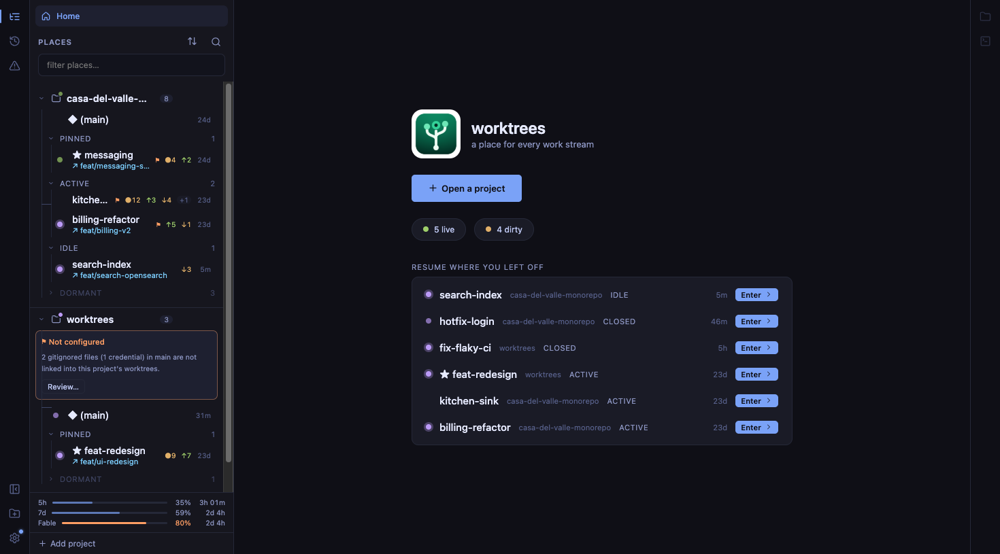

# Session: the afterglow dot — a place stays lit after Claude finishes

- **Date:** 2026-08-09
- **Worktree:** ui-tweaks
- **Branches:** `ui-afterglow-dot` (feature), `ui-release-0-10-0` (version bump), `ui-close-out-afterglow` (this archive)
- **PRs:** [#99](https://github.com/penard-monkey/worktrees/pull/99) (squash-merged → `17de7e4`), [#100](https://github.com/penard-monkey/worktrees/pull/100) (release → `c1b60dd`)
- **Release:** **v0.10.0**, tagged and published (10 assets, signed bundles)
- **Planning files:** none — the design work happened in two fable memos instead

## Where this started

> We have the status dots next to the worktrees in our left nav. we have green
> blinking dot and we have an amber one when we need to engage with the claude
> session. I'm thinking of another status which is time based. For example once
> the green dot finishes, we just lose the visibility. I was thinking we could
> have some sort of indicator that it has completed and it slowly transitions
> over time until it eventually goes to idle. Ideally showing which are latest.
> However that needs to take some things into account, just opening up the
> session isn't enough, we need to have performed a task with claude durring a
> concept of a session.

Two fable passes: one design memo before any code, one adversarial review of the
finished diff. Both changed the outcome materially — see Dead ends.

## What shipped (v0.10.0)

A third dot state in the nav: a purple, never-animated **ember**, stamped when a
session finishes work, decaying over the working day.

| tier | age | look |
|---|---|---|
| `t1` | < 15m | full `--done` + 3px halo |
| `t2` | 15m – 2h | 65 % |
| `t3` | 2h – 12h | 30 % |
| — | ≥ 12h | empty slot |

- **`crates/worktrees-core/src/store.rs`** — `last_worked_epoch` on `Declared`,
  monotonic, migrating for free through serde's flatten-`extra` (no version
  bump). Two tests: round-trip beside unknown keys, and that it does NOT feed
  lifecycle reconciliation (only `last_opened_epoch` does).
- **`crates/worktrees-core/src/project.rs`** — `claude_dir_in` made `pub` so the
  app can locate a session's transcript dir.
- **`app/src-tauri/src/lib.rs`** — `completion_edges()` (extracted, pure,
  unit-tested), `place_key_for`, `stamp_worked`, `backfill_worked`, `tail_lines`,
  `hist_epoch`, `is_work_prompt`, `mtime_epoch`; new `sessions:done { path,
  epoch }` event; the poll thread now tracks dwell counters and dedups the busy
  set.
- **`app/src/App.tsx`** — `doneTier`, `usedEpoch`/`recencyEpoch`, the
  `donePaths` overlay Map, a 60 s visibility-gated decay tick, unified
  `dotClass`/`dotTitle` for nav + Resume, `t1`-only project rollup.
- **`app/src/App.css` / `tokens.css`** — `--done: var(--ai)`, three static
  tiers, `.picon.done`.
- **`app/src/mock/*`** — `sessions:done` mirrored in `ACTIVITY_CYCLE`,
  `__mock.finishTask(path, minsAgo)`, fixtures pre-aged into every tier plus a
  glowing `(main)`.
- **`docs/ai-profiles-manual-checks.md`** — new §10, nine manual checks.

Also in the release, from a parallel stream: gitignored files in the Files tab,
plus two file-tree fixes (#97, #98).

## Decisions

**The signal is the busy→not-busy edge, not a session's existence.** The user's
constraint was that opening a session must not count. That turned out to be free:
an open-but-quiet session probes `status: "idle"`, so presence alone never
qualifies. A two-tick (~6 s) dwell guard discards blips.

**Hue separates the ember from the busy dot, never motion.** The first proposal
was "green blinking = busy, green solid = done". Fable killed it:
`prefers-reduced-motion` disables the blink (`tokens.css`), so for those users
both states collapse to the same static green pixel. `--done` aliases `--ai`,
which already means *claude* in the token vocabulary and is re-declared by all
six themes — so a new theme gets a correct ember for free.

**Tiers are computed in JS on a visibility-gated tick, not keyframed.** A 12h CSS
animation is frozen at frame 0 under reduced motion (full brightness forever —
the inverse of the signal), restarts whenever `PlaceRow` remounts, and cannot be
asserted mid-flight without flake.

**Discrete tiers, not a continuous fade.** Absolute opacity is unreadable alone;
only the contrast between rows carries. Steps are also assertable with
`getComputedStyle`, which the house rules require.

**`sessions:done` is a separate event from `sessions:busy`.** One is a live SET
that reconciles to current truth every tick; the other is a monotonic FACT.
Merging them would make a completion something the next tick could retract.

**Two sources for the stamp, max-merged.** The durable half
(`declared.last_worked_epoch`) survives restarts and is backfilled at launch; the
event half is instant. A snapshot only re-pulls on `places:changed`, which a
completion does not trigger — finishing a task leaves no tmux trace.

**Horizon: 12h.** The user first chose 2h/two tiers, then reconsidered — 12h
means overnight work still glows at 30 % when you sit down.

**The nav tree's recency sort was re-keyed too, deliberately.** Fable's verdict:
a place rising when its work lands is the sort telling the truth, and the reorder
rides the ≤30 s snapshot cadence, not the decay tick.

## Dead ends / gotchas

**The slug came from the raw cwd basename — the feature's core promise, broken.**
`cd app && claude` (entirely normal in this repo) resolved to slug `"app"`:
`store::edit`'s `.entry().or_default()` would have *created* a phantom `app`
entry, given a false ember to any real worktree named `app`, and missed the place
that actually did the work. Symlinked spellings failed the same way — the
main-root comparison canonicalized, the slug derivation did not. Fix:
`git rev-parse --show-toplevel` resolves any cwd to its worktree root, including
for linked worktrees, and normalizes the spelling on the way. Note
`place_json` (project.rs) *already documents* this nesting hazard for main-session
adoption and excludes `.worktrees/`; the new code reproduced the hazard without
the guard, and the comment claiming it "mirrors place_json exactly" was false.

**Unifying the recency key silently added a commit-epoch fallback to Resume and
auto-restore.** The old nav sort had `?? last_commit_epoch`; the old Resume and
Recent-lens sorts did not. Collapsing all three into one helper handed Resume a
third input nobody asked for: a CLI-created worktree, never opened, never worked,
whose branch tip is yesterday, would top the Resume list and become the
restore-on-launch target. Split into `usedEpoch` (opened ∨ worked, no fallback)
for the "where was I" lists and `recencyEpoch` (`usedEpoch || commit`) for the
nav tree and ⌘K, exactly as those two were before.

**`read_to_string` on a tail seek is a silent, sticky failure.** Seeking to
`len - 512K` in `history.jsonl` lands at an arbitrary byte; if it splits a
multi-byte char — routine in a file full of pasted prompts — a strict decode
throws away *the whole tail*, not just the fragment that gets dropped anyway.
And the boundary only moves as the file grows, so it stays broken. Now bytes +
`from_utf8_lossy`, with a test that splits a 🎉 mid-character.

**The transcript-mtime refinement quietly undid the denylist.** Refining a stamp
with the *directory's* newest `.jsonl` meant a later `/clear` — correctly filtered
out of the history scan — could still drag a ten-hour-old stamp up to "just
finished", because `/clear` starts a fresh session file. Fixed by refining with
**that prompt's own** `<sessionId>.jsonl` only. This also removed a `read_dir`
per qualifying line.

**Duplicate cwds halve the dwell guard.** Two sessions in one dir each push their
cwd; `claude_activity` doesn't dedupe. The counter would reach 2 in a single
tick. `busy.dedup()` after the sort, and a test that documents *why* the caller
must.

**The backfill's `sessions:done` emits are almost certainly dropped.** It runs at
thread spawn, before the webview registers its listener, and Tauri events with no
listener have no retry. Normally covered because the first `list_workspace` reads
the stores after the writes — but the backfill shells out to git per unique path,
so it can lose that race. One `places:changed` at the end when anything was
stamped closes it.

**`prefers-reduced-motion` in `tokens.css` is `* { animation: none !important }`.**
Worth remembering: any future signal that leans on motion has no fallback for
those users unless it also differs in hue or luminance.

**Fixture epochs are frozen at a fixed `NOW` (~2026-07-21).** Anything asserted
against wall-clock ages needs its own `REAL_NOW`, or it ages out of every tier
and the harness boots showing nothing.

**The overlay is monotonic, which makes tier testing directional.** `finishTask`
can only ever move a stamp *forward*, so a Playwright run must walk tiers
oldest→freshest (800m → 300m → 0m). The first attempt went the other way and
every probe after the first read `t1`; the code was right and the test was wrong.

**`git worktree` + `gh pr merge --delete-branch`.** The delete step tries to check
out `main`, which is already checked out in the primary worktree, and errors —
*after* the merge has already succeeded. Harmless, but the error output reads
like the merge failed.

**The branch was 3 commits behind `origin/main`** despite the worktree looking
idle — exactly what CLAUDE.md warns about. `git stash` → branch off the fetched
tip → `stash pop` produced two conflicts (CHANGELOG, mock/install.ts) that a
naive commit-then-rebase would have hit later and messier.

## Verification

- Gates, twice (once before the rebase onto the moved main, once after):
  `make test` (288 bats), `make lint`, `cargo test` core 207 / cli 6 / app 7,
  `cargo check -p app`, `tsc --noEmit`.
- CI: 9 jobs green on #99, 9 on #100. Release workflow: 7 jobs, 10 assets.
- Playwright against the mock harness asserted `getComputedStyle`: tier
  opacities 1 / 0.65 / 0.3, `animationName: "none"` in all three, `--done`
  resolving to `rgb(187,154,247)`, the `picon done` rollup badge, and
  busy > waiting > done precedence live.
- Parse contract checked against the real `~/.claude/history.jsonl`: `timestamp`
  is an int (ms), `project` is the worktree path, 5 housekeeping lines filtered
  in-window, 7 places would have backfilled.
- `git rev-parse --show-toplevel` verified from a real subdirectory
  (`app/src-tauri` → `ui-tweaks`) and from the main root (→ `(main)`).
- **Not verified:** the real signal path end to end. There is no fake `claude`,
  so the busy→ember hand-off has never run against a real session — only against
  the mock. That is what §10 of `docs/ai-profiles-manual-checks.md` is for.

## Follow-ups

- **Run `docs/ai-profiles-manual-checks.md` §10 against the real app.** Nine
  checks, none of them covered by CI. The load-bearing one is `/clear`: it must
  neither light a place nor inflate an existing ember.
- Accepted costs, documented in code rather than fixed: a `kill -9`'d busy
  session stamps "finished" (the busy-exit edge cannot tell completion from
  death), and a completion that starts and ends inside the inline auto-fetch
  stall is missed until the next launch's backfill.
- Roadmap: gating the backend poll thread on visibility would break this
  feature's ability to observe completions while the window is hidden — noted on
  that entry.
