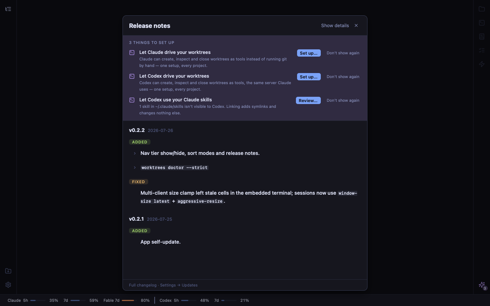

# Session — offers you can come back to

- **Date:** 2026-09-30
- **Worktree:** `.worktrees/offers-reopen`
- **Branch:** `offers-reopen`
- **PR:** [#384](https://github.com/penard-monkey/worktrees/pull/384), squashed as `0023ed3`. Three commits: the fix, the rebase onto #382, and the review nits.
- **Release tag:** v0.34.1 (shipped together with the pi nav-dot fix, #382)
- **Planning files:** `planning.tar.gz` (the lane's brief `.planning/brief.md` and `progress.md`; no task_plan/findings).

## What shipped

**The bug David hit.** After an update, What's new lists setup offers (Claude / Codex / pi MCP, Codex skills). Pressing "Set up…" on one closed the sheet and deep-linked into Settings, and the other offers were gone until the next release:
- `app/src/App.tsx` fed the manual reopen (Settings → Updates → Release notes) `offers={whatsNew.manual ? [] : offers}`. The comment's reason was that the reader was "already in Settings".
- Taking an offer has to close the notes, because the destination is underneath them.
- So nothing led back to the rest of the band. The offers themselves were still pending in `pendingOffers`; only the way to them had gone.

**Fix (all frontend):**
- **Every view of the notes carries the band.** The feed is now `offers={offers}`. Inside `WhatsNewModal`, `manual` only retitles the header.
- **A way back.** A sparkles button with a count (`.rail-offers` / `.rail-count`) sits at the foot of the dock rail (`rail rail-right`).
  - It is gated on `offers.length > 0` alone and opens `showReleaseNotes()`, which is the same notes and band.
  - That end of the rail is empty in every layout. It is the bottom-right corner unless Places is mirrored onto the right.
- **One mark per fact.** The gear's purple `upd-offer` dot is removed, so `railAlert = updateAvail` again. A dot on the gear led to Settings, which lists no offers.
- **Supporting pieces:**
  - `Icons.Sparkles` (Lucide).
  - `offersTitle(n)` in `offers.ts`, plus a header section there: "one list, two ways in".
  - Stale comments that reasoned from the gear dot were rewritten in McpPanel, AgentSetup, SettingsSheet, offers.ts and ROADMAP.

## Decisions

- **Open the release notes, not a new popover.** The brief allowed either. The notes already have the band, `useEscape`, scrim dismissal and stacking over Settings. A popover would have been a second surface, with the outside-click and `pointer-events` traps AGENTS.md records for `.usage-pop`. A new offer needs no surface work: return it from `pendingOffers` and both ways in list it.
- **Remove the gear's offer dot rather than keep both.** The brief said "no second competing badge". Keeping the purple dot next to a count button would have been two marks for one fact, in opposite corners.
- **Dismissal unchanged.** The band's "Don't show again" and each panel's "Stop suggesting this" both call the same `silenceOffer` → `dismissPatch` (fingerprint). One behaviour, offered where you stand.
- **No "undo a dismissal" list.** Silencing loses only the reminder. Every destination panel still shows the state and its setup button, so there is nothing to recover.
- **Count badge contrast.** `--txt-hi` on a 22% `--ai` tint over `--bg-abyss`. At 38%, tokyo-day and catppuccin-latte measured 3.8 and 3.6:1; at 22% every theme is ≥ 4.5:1, because a lighter tint helps both dark text on light rails and light text on dark ones. The glyph is 2.6:1 on tokyo-day's rail, the same `--ai` glyph the band and the agent marks already use.
- **Font size.** Review asked for `--fs-micro` instead of a literal 9px. Re-measured in WebKit: the badge is still 13×13 with no overflow.

## Dead ends / gotchas

- **Chrome DevTools MCP was held by another session** ("browser is already running for …/chrome-profile"). Headless Playwright in the scratch dir (`npm i playwright && npx playwright install webkit chromium`) worked, and it gave the WebKit measurement AGENTS.md asks for anyway.
- **A fresh worktree's `pnpm` was broken.** corepack's pnpm 12.8.1 cache has no `bin/pnpm.cjs`, and the PATH's node was 26 even after `nvm use`. What worked: `PATH=~/.nvm/versions/node/v22.19.0/bin:$PATH node ~/.cache/node/corepack/v1/pnpm/11.5.2/bin/pnpm.cjs install --frozen-lockfile`. The node version AGENTS.md names (22.23.2) is not installed on this machine.
- **My own check had a slicing bug on the first try.** The "`manual` only retitles" guard counted the prop's declaration in the signature as a use. It is fixed by slicing past `}) {`. A mutation (`!manual &&` on the band) then turned it red as intended.
- **CHANGELOG rebase onto #382.** Both sides opened `### Fixed` under `## [Unreleased]`. I resolved it by keeping both ITEMS under one header and counted with awk (1 and 1), per AGENTS.md's duplicate-header note.

## Verification

- **`app/scripts/offers-check.mjs` extended.** It now pins:
  - the feed (`offers={offers}`);
  - the modal's use of `manual`;
  - the rail button's gate (offers alone), its click (`showReleaseNotes`) and its count;
  - that `railAlert` no longer reads offers, and that `upd-offer` is gone;
  - `offersTitle` agreeing in number.

  Against HEAD's sources it failed 6 checks; on the branch it passes.
- **Mock harness** (port 1437) in headless Chromium and WebKit at 1280×800:
  - The button measures 32×32 and ends 8px above the usage strip. `elementFromPoint` hits both the button and its count.
  - Clicking it opens the notes with all 3 rows.
  - Taking an offer opens Settings, and the button still shows 3.
  - Settings → Release notes shows the band.
  - Dismissing the rows one at a time counts 3 → 2 → 1, then the button is gone.
  - No page errors.
- **Gates:** release build, bats 395/395, lint, worktrees-core 563, worktrees-cli, app lib, tsc, cargo check and every `app/scripts/*-check.mjs` from the repo root all passed. CI passed 9/9 on each push, the last being run 36748137390.
- **Not done:** the real app. Nobody has looked at the button in WKWebView under a light theme or watched the count drop after a real install (see Follow-ups).

## Follow-ups

- **Real-app checks** (ROADMAP):
  - count legibility in tokyo-day and catppuccin-latte;
  - the count dropping after a real `Set up…` install.
- **The project-scope MCP probe caveat** (already in ROADMAP, updated). App's startup probe runs with `repo: null`, so a machine with the server at local or project scope is still offered it. That now lights the rail button on every screen rather than the gear.
